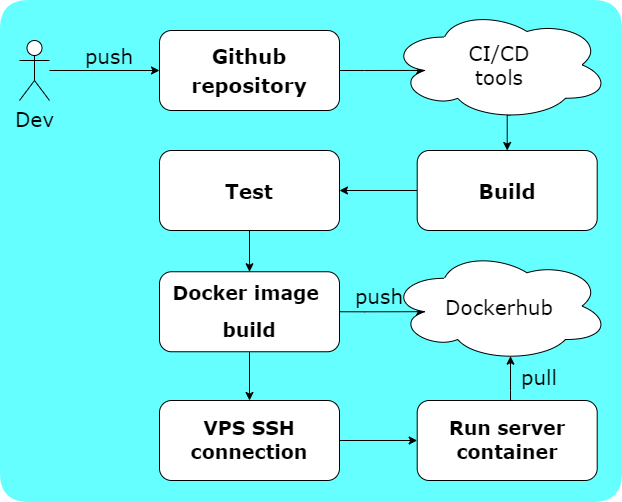

# DevOps Final Project 

##### Multibranch CI/CD pipeline 
Project uses 
1. Amazon Web Services for running tools and web server hosting
2. GitHub as application source repository
3. DockerHub as image storage
4. Jenkins as CI/CD tool
5. Docker for packaging, delivering and running application

